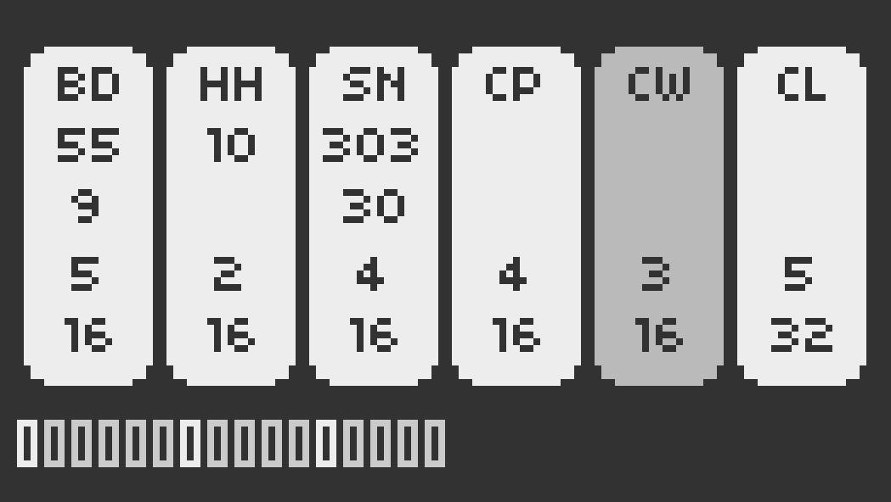

# hachi

A small 808 drum machine for monome norns.
I’ve written this script to learn Lua, SuperCollider and the norns environment.
The sound engine is based on the SC808 by [Yoshinosuke Horiuchi](https://www.patreon.com/4H). I've implemented only my favorite sounds, to keep the GUI in a single norns page.
The sequencer borrow some techniques from *playfair* euclidean drummer written by [@tehn](https://github.com/tehn) with new features (randomizer, real time recording).

## how to use hachi
k1 shift  
k1+k3 randomize all  
k1+k3 clear all (if stopped)  
k1+k3 randomize (if started)  
k2 start/stop  
k3 insert step (if started)   
k3 randomize all (if stopped)   
e1 instrument select  
e2 drum parameter 1  
e3 drum parameter 2  
e2+shift number of pulses  
e3+shift number of steps  

